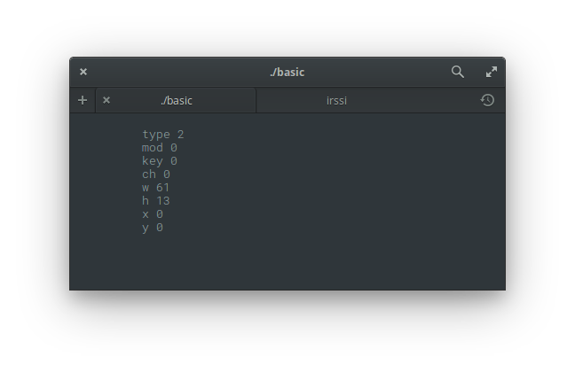

<p align="center">  </p>

This is a `Red/System` [Termbox](https://github.com/nsf/termbox/) wrapper. I've only tested it on Linux (*elementary OS*). Red is currently 32-bit only so you need to build a 32-bit shared Termbox library.

> `tb-blit` and `tb-cell-buffer` functions are currently disabled.

## Functions and structs

```
tb-cell: alias struct! [
  ch [integer!]
  fg [integer!]
  bg [integer!]
]

tb-event: alias struct! [
  type [byte!]
  mod [byte!]
  key [integer!]
  ch [integer!]
  w [integer!]
  h [integer!]
  x [integer!]
  y [integer!]
]

tb-init: function [ return: [integer!] ]

tb-init-file: function [ name [c-string!] return: [integer!] ]

tb-init-fd: function [ inout [integer!] return: [integer!] ]

tb-shutdown: function []

tb-width: function [ return: [integer!] ]

tb-height: function [ return: [integer!] ]

tb-clear: function []

tb-set-clear-attibutes: function [ fg [integer!] bg [integer!] ]

tb-present: function []

tb-set-cursor: function [ cx [integer!] cy [integer!] ]

tb-put-cell: function [
  x [integer!]
  y [integer!]
  cell [tb-cell]
]

tb-change-cell: function [
  x [integer!]
  y [integer!]
  ch [integer!]
  fg [integer!]
  bg [integer!]
]

tb-blit: DISABLED

tb-cell-buffer: DISABLED

tb-select-input-mode: function [
  mode [integer!]
  return: [integer!]
]

tb-select-output-mode: function [
  mode [integer!]
  return: [integer!]
]

tb-peek-event: function [
  event [tb-event]
  timeout [integer!]
  return: [integer!]
]

tb-poll-event: function [
  event [tb-event]
  return: [integer!]
]

tb-print: function [
  x [integer!]
  y [integer!]
  str [c-string!]
  fg [integer!]
  bg [integer!]
]

log-tb-event: function [
  e [tb-event]
  x [integer!]
  y [integer!]
]
```

Examples can be found inside the `examples` folder.

## Constants

```
#define TB-KEY-F1               [FFFFh - 0]
#define TB-KEY-F2               [FFFFh - 1]
#define TB-KEY-F3               [FFFFh - 2]
#define TB-KEY-F4               [FFFFh - 3]
#define TB-KEY-F5               [FFFFh - 4]
#define TB-KEY-F6               [FFFFh - 5]
#define TB-KEY-F7               [FFFFh - 6]
#define TB-KEY-F8               [FFFFh - 7]
#define TB-KEY-F9               [FFFFh - 8]
#define TB-KEY-F10              [FFFFh - 9]
#define TB-KEY-F11              [FFFFh - 10]
#define TB-KEY-F12              [FFFFh - 11]
#define TB-KEY-INSERT           [FFFFh - 12]
#define TB-KEY-DELETE           [FFFFh - 13]
#define TB-KEY-HOME             [FFFFh - 14]
#define TB-KEY-END              [FFFFh - 15]
#define TB-KEY-PGUP             [FFFFh - 16]
#define TB-KEY-PGDN             [FFFFh - 17]
#define TB-KEY-ARROW-UP         [FFFFh - 18]
#define TB-KEY-ARROW-DOWN       [FFFFh - 19]
#define TB-KEY-ARROW-LEFT       [FFFFh - 20]
#define TB-KEY-ARROW-RIGHT      [FFFFh - 21]
#define TB-KEY-MOUSE-LEFT       [FFFFh - 22]
#define TB-KEY-MOUSE-RIGHT      [FFFFh - 23]
#define TB-KEY-MOUSE-MIDDLE     [FFFFh - 24]
#define TB-KEY-MOUSE-RELEASE    [FFFFh - 25]
#define TB-KEY-MOUSE-WHEEL-UP   [FFFFh - 26]
#define TB-KEY-MOUSE-WHEEL-DOWN [FFFFh - 27]

#define TB-KEY-CTRL-TILDE       00h
#define TB-KEY-CTRL-2           00h ; clash
#define TB-KEY-CTRL-A           01h
#define TB-KEY-CTRL-B           02h
#define TB-KEY-CTRL-C           03h
#define TB-KEY-CTRL-D           04h
#define TB-KEY-CTRL-E           05h
#define TB-KEY-CTRL-F           06h
#define TB-KEY-CTRL-G           07h
#define TB-KEY-BACKSPACE        08h
#define TB-KEY-CTRL-H           08h; clash
#define TB-KEY-TAB              09h
#define TB-KEY-CTRL-I           09h ; clash
#define TB-KEY-CTRL-J           0Ah
#define TB-KEY-CTRL-K           0Bh
#define TB-KEY-CTRL-L           0Ch
#define TB-KEY-ENTER            0Dh
#define TB-KEY-CTRL-M           0Dh ; clash
#define TB-KEY-CTRL-N           0Eh
#define TB-KEY-CTRL-O           0Fh
#define TB-KEY-CTRL-P           10h
#define TB-KEY-CTRL-Q           11h
#define TB-KEY-CTRL-R           12h
#define TB-KEY-CTRL-S           13h
#define TB-KEY-CTRL-T           14h
#define TB-KEY-CTRL-U           15h
#define TB-KEY-CTRL-V           16h
#define TB-KEY-CTRL-W           17h
#define TB-KEY-CTRL-X           18h
#define TB-KEY-CTRL-Y           19h
#define TB-KEY-CTRL-Z           1Ah
#define TB-KEY-ESC              1Bh
#define TB-KEY-CTRL-LSQ-BRACKET 1Bh ; clash
#define TB-KEY-CTRL-3           1Bh ; clash
#define TB-KEY-CTRL-4           1Ch
#define TB-KEY-CTRL-BACKSLASH   1Ch ; clash
#define TB-KEY-CTRL-5           1Dh
#define TB-KEY-CTRL-RSQ-BRACKET 1Dh ; clash
#define TB-KEY-CTRL-6           1Eh
#define TB-KEY-CTRL-7           1Fh
#define TB-KEY-CTRL-SLASH       1Fh ; clash
#define TB-KEY-CTRL-UNDERSCORE  1Fh ; clash
#define TB-KEY-SPACE            20h
#define TB-KEY-BACKSPACE2       7Fh
#define TB-KEY-CTRL-8           7Fh ; clash

#define TB-MOD-ALT    01h
#define TB-MOD-MOTION 02h

#define TB-DEFAULT 00h
#define TB-BLACK   01h
#define TB-RED     02h
#define TB-GREEN   03h
#define TB-YELLOW  04h
#define TB-BLUE    05h
#define TB-MAGENTA 06h
#define TB-CYAN    07h
#define TB-WHITE   08h

#define TB-BOLD      0100h
#define TB-UNDERLINE 0200h
#define TB-REVERSE   0400h

#define TB-EVENT-KEY    1
#define TB-EVENT-RESIZE 2
#define TB-EVENT-MOUSE  3

#define TB-EUNSUPPORTED-TERMINAL -1
#define TB-EFAILED-TO-OPEN-TTY   -2
#define TB-EPIPE-TRAP-ERROR      -3

#define TB-HIDE-CURSOR -1

#define TB-INPUT-CURRENT 0
#define TB-INPUT-ESC     1
#define TB-INPUT-ALT     2
#define TB-INPUT-MOUSE   4

#define TB-OUTPUT-CURRENT   0
#define TB-OUTPUT-NORMAL    1
#define TB-OUTPUT-256       2
#define TB-OUTPUT-216       3
#define TB-OUTPUT-GRAYSCALE 4
```

## Installation

On **Debian** based Linux distros the 32-bit shared Termbox library can be built with something like this:

```
sudo apt install gcc-5-multilib
CFLAGS=-m32 LDFLAGS=-m32 ./waf configure --prefix=/usr
./waf
```

Copy the `termbox.reds` file into your project folder and use it that way. Install the shared library via `waf` or simply copy it next to your source files.

**Example**: In this repository I've just copied the `.so` into the examples folder as I had issues installing the 32-bit version next to the existing 64-bit one.
